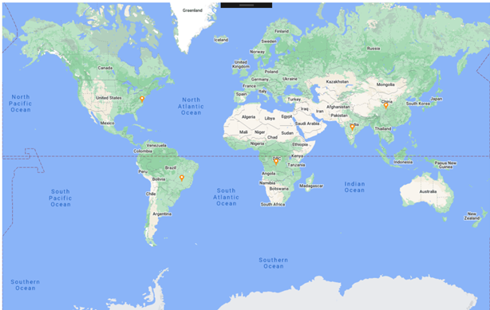

# How-to-use-the-google-map-API-to-display-the-roadmap-in-Xamarin.Forms-Maps
This article explains how to show the different map view using the google map API using  the imagery layer of Xamarin.Forms Syncfusion SfMaps.

*Street map view
 
 

To load the google map view, assign the Google maps API Uri link (or any tile maps provider) with required x, y, zoom level and lyrs value to the Uri property from the argument of RequestTileUri event. You can get the different maps view based on the value of lyrs as per in below table values

**Layer Value	View Type**

h	Roads only 
m	Standard roadmap (street map) 
p	Terrain 
r	Somehow altered roadmap 
s	Satellite only
t	Terrain only 
y	Hybrid 

Please find the code snippet

[XAML]

*Define the SfMaps with required marker settings and invoke the RequestTileUri event

```
<maps:SfMaps ZoomLevel="2">
        <maps:SfMaps.Layers>
            <maps:ImageryLayer RequestTileUri="ImageryLayer_RequestTileUri">
                <maps:ImageryLayer.MarkerSettings>
                    <maps:MapMarkerSetting MarkerIcon="Image" ImageSource="pin.png" IconSize="15"/>
                </maps:ImageryLayer.MarkerSettings>
                <maps:ImageryLayer.Markers>
                    <maps:MapMarker Latitude="38.8833" Longitude= "-77.0167"/>
                    <maps:MapMarker Latitude="-15.7833" Longitude= "-47.8667"/>
                    <maps:MapMarker  Latitude="21.0000" Longitude= "78.0000"/>
                    <maps:MapMarker Latitude="35.0000" Longitude= "103.0000" />
                    <maps:MapMarker Latitude="-4.0383" Longitude= "21.7586" />
                </maps:ImageryLayer.Markers>
            </maps:ImageryLayer>
        </maps:SfMaps.Layers>
    </maps:SfMaps>

```
[C#]

*Here loading the Standard roadmap hence setting the lyrs=m

```
        private void ImageryLayer_RequestTileUri(object sender, Syncfusion.SfMaps.XForms.TileUriArgs e)
        {
            var link = "http://mt1.google.com/vt/lyrs=m&x=" + e.X.ToString() + "&y=" + e.Y.ToString() + "&z=" + e.ZoomLevel.ToString();            
            e.Uri = link;
        }
```

**See also**
 
[How to customize the bubble marker in Xamarin.Forms Maps (SfMaps)](https://help.syncfusion.com/xamarin/maps/bubblemarker#customizing-bubble-marker)
 
[How to customize the data labels in Xamarin.Forms Maps (SfMaps)](https://help.syncfusion.com/xamarin/maps/datalabels#customizing-data-labels)
 
[How to customize the legend in Xamarin.Forms Maps (SfMaps)](https://help.syncfusion.com/xamarin/maps/legend)
 
[How to customize the tooltip in Xamarin Maps (SfMaps)](https://help.syncfusion.com/xamarin/maps/tooltip)


